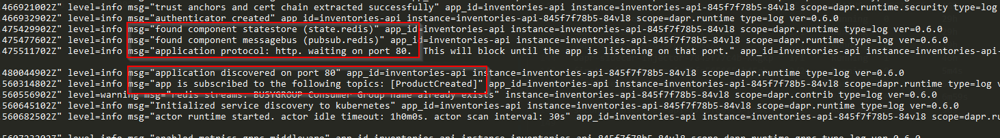
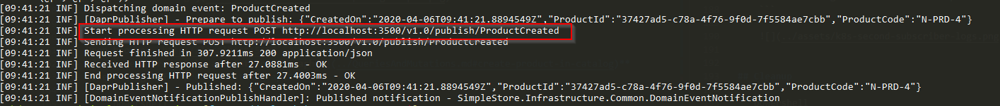
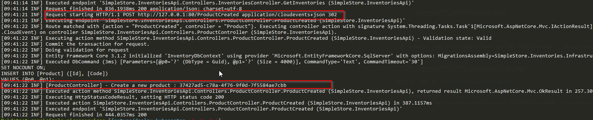

# Prerequisites

1. Install Docker for Desktop within Kubernetes
2. Download [Dapr CLI (currently is 0.6.0)](https://github.com/dapr/cli/releases/download/v0.6.0/dapr_windows_amd64.zip)

    ```powershell
    λ  dapr --version
    ```

    ```powershell
    CLI version: 0.6.0
    Runtime version: 0.6.0
    ```

3. Install Dapr to Kubernetes

    ```powershell
    dapr init --kubernetes
    ```
3. Install [Helm 3 (currently is 3.1.2)](https://get.helm.sh/helm-v3.1.2-windows-amd64.zip)

    ```powershell
    λ  helm version
    ```

    ```powershell
    version.BuildInfo{Version:"v3.1.2", GitCommit:"d878d4d45863e42fd5cff6743294a11d28a9abce", GitTreeState:"clean", GoVersion:"go1.13.8"}
    ```

## Build docker images for Apis

1. Build with `docker-compose`

    ```powershell
    docker-compose build
    ```

2. Verify

    ```powershell
    λ  docker images "simplestore-*" --format "table {{.ID}}\t{{.Size}}\t{{.Repository}}\t{{.Tag}}"
    ```

    ```powershell
    IMAGE ID            SIZE                REPOSITORY                   TAG
    009a5ee8c475        143MB               simplestore-graphql          dev
    ba1a0f0a8664        170MB               simplestore-inventories      dev
    af8bc6b86d60        151MB               simplestore-productcatalog   dev
    ```

## Start Installing

```powershell
cd .\Helm
```

### Install Redis

```powershell
λ  helm install redis .\redis\
```

```powershell
NAME: redis
LAST DEPLOYED: Sun Apr  5 16:48:25 2020
NAMESPACE: default
STATUS: deployed
REVISION: 1
NOTES:
1. Get the application URL by running these commands:
  export POD_NAME=$(kubectl get pods --namespace default -l "app.kubernetes.io/name=redis,app.kubernetes.io/instance=redis" -o jsonpath="{.items[0].metadata.name}")
  echo "Visit http://127.0.0.1:8080 to use your application"
  kubectl --namespace default port-forward $POD_NAME 8080:80
```

### Configure Statestore & PubSub for Dapr

```powershell
λ  kubectl apply -f .\redis-components\
```

```powershell
component.dapr.io/messagebus created
component.dapr.io/statestore created
```

### Install simplestore-sqlserver

```powershell
λ  helm install simplestore-sqlserver .\simplestore-sqlserver\
```

```powershell
NAME: simplestore-sqlserver
LAST DEPLOYED: Mon Apr  6 16:52:38 2020
NAMESPACE: default
STATUS: deployed
REVISION: 1
```

### Install ProductCatalogApi

```powershell
λ  helm install product-catalog-api .\product-catalog-api\
```

```powershell
NAME: product-catalog-api
LAST DEPLOYED: Mon Apr  6 16:38:42 2020
NAMESPACE: default
STATUS: deployed
REVISION: 1
```

### Install InventoriesApi

```powershell
λ  helm install inventories-api .\inventories-api\
```

```powershell
NAME: inventories-api
LAST DEPLOYED: Mon Apr  6 16:14:22 2020
NAMESPACE: default
STATUS: deployed
REVISION: 1
```

### Install GraphQLApi

```powershell
λ  helm install graphql .\graphql\
```

```powershell
NAME: graphql
LAST DEPLOYED: Mon Apr  6 16:40:08 2020
NAMESPACE: default
STATUS: deployed
REVISION: 1
```

## Verify Installation

### Get Pods

```powershell
λ  kubectl get po
```

```powershell
λ  kubectl get po
NAME                                     READY   STATUS    RESTARTS   AGE
dapr-operator-7d9668fd8b-wbckw           1/1     Running   0          4h44m
dapr-placement-7dbcc6bf59-sb4df          1/1     Running   0          4h44m
dapr-sentry-756f7799fd-kkp2x             1/1     Running   0          4h44m
dapr-sidecar-injector-7849f77c4b-lx2gb   1/1     Running   0          4h44m
graphql-64d9dd8b9c-wmmtv                 2/2     Running   0          18s
inventories-api-845f7f78b5-84vl8         2/2     Running   0          26m
product-catalog-api-7bc78559cd-vfb97     2/2     Running   0          103s
redis-5c7b7d5b89-p8l4n                   1/1     Running   0          4h19m
simplestore-sqlserver-c56948db9-5wzjx    1/1     Running   0          4h18m
```

### Observe logs of InventoriesApi

```powershell
λ  kubectl logs inventories-api-845f7f78b5-84vl8 -c daprd
```



### Verify how PubSub work

- Open browser `http://localhost:5100`
- **[Create a Product by a mutation of GraphQL](../QueriesAndMutations.md#create-product-in-catalog)**
- Observe logs of **product-catalog-api**

    ```powershell
    λ  kubectl logs product-catalog-api-7bc78559cd-vfb97 -c product-catalog-api
    ```

    

- Observe logs of **inventories-api**

    ```powershell
    λ  kubectl logs inventories-api-845f7f78b5-84vl8 -c inventories-api
    ```

    

## Cleanup

```powershell
λ  helm uninstall redis product-catalog-api inventories-api graphql simplestore-sqlserver
```

```poweshell
release "redis" uninstalled
release "product-catalog-api" uninstalled
release "inventories-api" uninstalled
release "graphql" uninstalled
release "simplestore-sqlserver" uninstalled
```

```powershell
λ  kubectl delete -f .\redis-components\
```

```powershell
component.dapr.io "messagebus" deleted
component.dapr.io "statestore" deleted
```

```powershell
λ  dapr uninstall --kubernetes
```

```powershell
Removing Dapr from your cluster...
Dapr has been removed successfully
```