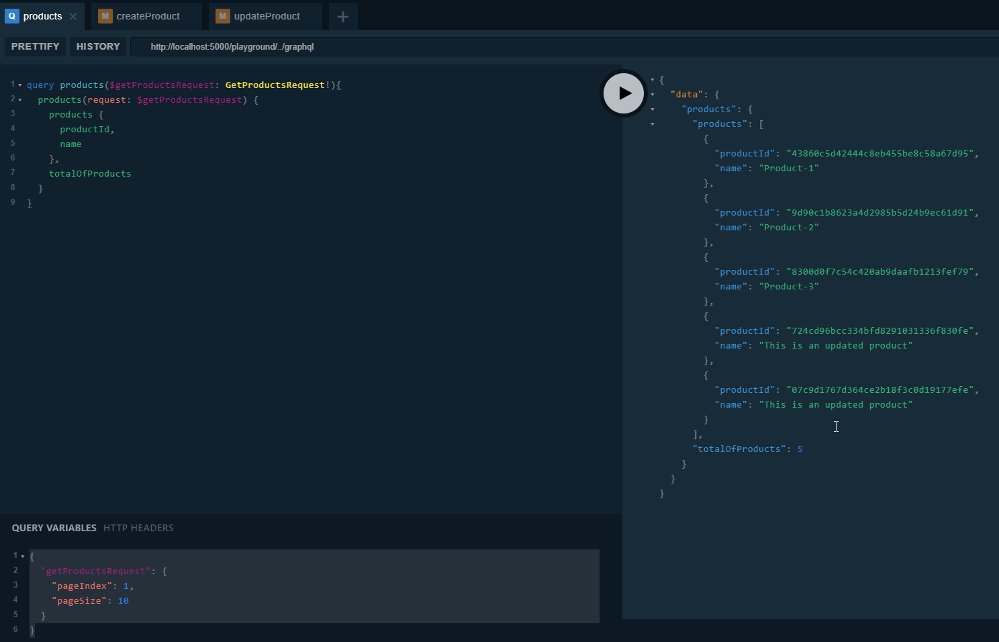
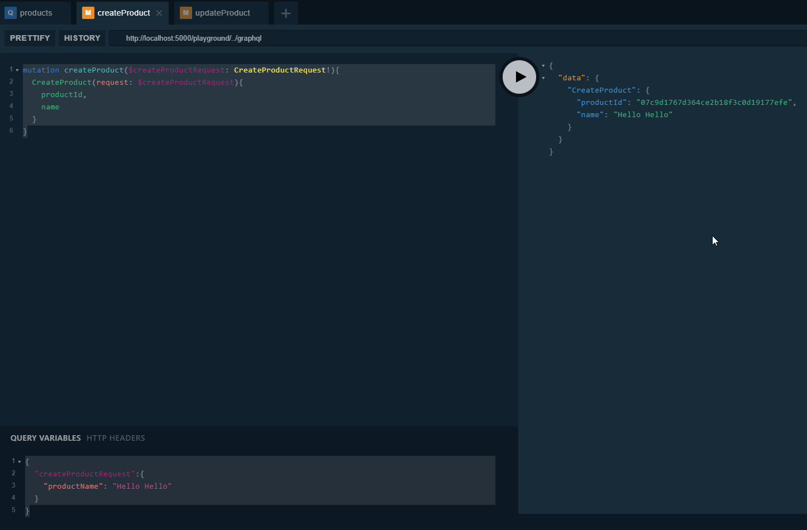
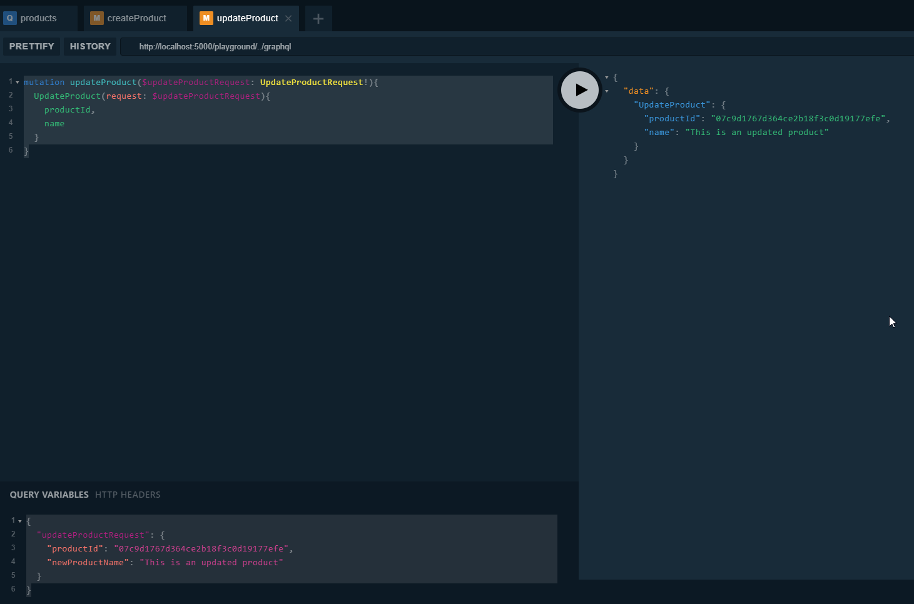

# simple-microservices
An example of building micro-services by .NET Core

## Getting started

### Step 1

```cmd
docker-compose -f docker-compose.yml -f docker-compose.override.yml up
```

### Step 2

```cmd
dotnet run -p .\src\Services\ProductCatalog\SimpleStore.ProductCatalogApi\SimpleStore.ProductCatalogApi.csproj
```

### Step 3

```cmd
dotnet run -p .\src\GraphApi\CoolStore.GraphApi\CoolStore.GraphApi.csproj
```

### Step 4

- Go to `http://localhost:5000`

#### Query Products

**Query**

```js
query products($getProductsRequest: GetProductsRequest!){
    products(request: $getProductsRequest) {
    products {
        productId,
        name
    },
    totalOfProducts
    }
}
```

**Variable**

```js
{
  "getProductsRequest": {
    "pageIndex": 1,
    "pageSize": 10
  }
}
```



#### Create new product

**Mutation**

```js
mutation createProduct($createProductRequest: CreateProductRequest!){
  CreateProduct(request: $createProductRequest){
    productId,
    name
  }
}
```

**Variable**
```js
{
  "createProductRequest":{
    "productName": "Hello Hello"
  }
}
```



#### Update Existing Product

**Mutation**

```js
mutation updateProduct($updateProductRequest: UpdateProductRequest!){
  UpdateProduct(request: $updateProductRequest){
    productId,
    name
  }
}
```

**Variable**

```js
{
  "updateProductRequest": {
    "productId": "07c9d1767d364ce2b18f3c0d19177efe",
    "newProductName": "This is an updated product"
  }
}
```



## Histories

- Add [Serilog.AspNetCore](https://github.com/serilog/serilog-aspnetcore) => see the issue [#1](https://github.com/kimcu-on-thenet/simple-microservices/issues/1)
- Implement a custom TypeConverter & JsonConverter in order to serve for StronglyType-Id => see the issue [#3](https://github.com/kimcu-on-thenet/simple-microservices/issues/3)
- Add GraphQL for **ProductCatalog**
  - Define the following requests:
    - GetProductsRequest
    - CreateProductRequest
    - UpdateProductRequest
  - Define ObjectTypes, QueryType & MutationTypes
  - Add StichedSchema functionality