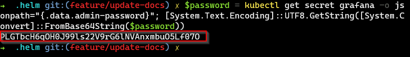
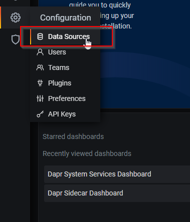
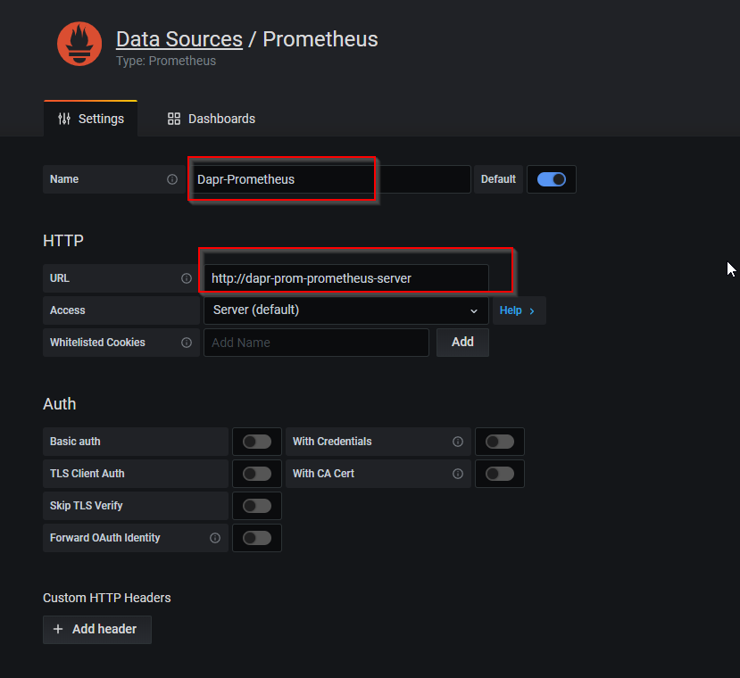
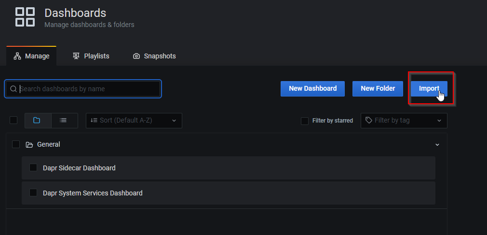

# How to install to Kubernetes

## Prerequisites

1. Docker for Desktop with ready Kubernetes
2. Helm 3

## Getting Started

### Add repositories for Helm

```powershell
helm repo add bitnami https://charts.bitnami.com/bitnami
```

```powershell
helm repo add ingress-nginx https://kubernetes.github.io/ingress-nginx
```

```powershell
helm repo add stable https://kubernetes-charts.storage.googleapis.com/
```

```powershell
helm repo add carlosjgp https://carlosjgp.github.io/open-charts/
```

```powershell
helm repo add dapr https://daprio.azurecr.io/helm/v1/repo
```

```powershell
helm repo update
```

### Install Helm's charts

Open PowerShell at `.\.helm`

1. Install MS SqlServer

    ```powershell
    helm install sqlserver stable/mssql-linux --version 0.11.2 -f .\sqlserver.dev.yaml
    ```

1. Install NGINX Ingress Controller

    ```powershell
    helm install nginx ingress-nginx/ingress-nginx
    ```

1. Install Seq

    ```powershell
    helm install seq stable/seq --version 2.2.0 -f .\seq.dev.yaml
    ```

1. Install Zipkin

    ```powershell
    helm install zipkin carlosjgp/zipkin --version 0.2.0 -f .\zipkin.dev.yaml
    ```


### Install Dapr and its components

1. Install Redis

    ```powershell
    helm install redis bitnami/redis -f .\redis.dev.yaml
    ```

1. Install Dapr on Kubernetes

    ```powershell
    helm install dapr dapr/dapr
    ```

1. Install Dapr's components

    ```poweshell
    kubectl apply -f .\components
    ```

### Deploy our services via Tye

1. Tye deploy

    ```powershell
    tye deploy ..\tye-k8s.yaml --interactive
    ```

1. **Notes:** We'll be asked to input the following

    - Enter the connection string to use for service 'sqlserver': 
        > Data Source=sqlserver,1433;User Id=sa;Password=P@ssword;MultipleActiveResultSets=True

    - Enter the URI to use for service 'zipkin': 
        > http://zipkin-collector:9411/api/v2/spans

    -  Enter the URI to use for service 'seq': 
        > http://seq:5341

1. Add hosts 

    ```text
    127.0.0.1	seq.simplestore.local
    127.0.0.1	zipkin.simplestore.local
    
    127.0.0.1	product.simplestore.local
    127.0.0.1	graphql.simplestore.local
    ```

### Deploy chart

#### Install Prometheus & Grafana

1. Install Prometheus

    ```powershell
    helm install dapr-prom stable/prometheus
    ```

1. Install Grafana

    ```powershell
    helm install grafana stable/grafana -f .\grafana.dev.yaml
    ```
### Update hosts file

```text
127.0.0.1	chart.simplestore.local
```

### Configure data-source for Grafana

1. Get password for **admin** account of Grafana

    ```powershell
    $password = kubectl get secret grafana -o jsonpath="{.data.admin-password}"; [System.Text.Encoding]::UTF8.GetString([System.Convert]::FromBase64String($password))
    ```

    

1. Open browser at `http://chart.simplestore.local` with the following credential
    - **Username**: admin
    - **Password**: [get-from-previous-step]
    > PLGTbcH6qOH0J99ls22V9rG6lNVAnxmbuO5Lf07O
    
1. Click Configuration Settings -> Data Sources

    

1. Configure for Prometheus DataSource

    

1. Import dashboard

    

## How to use

1. View Logging at `http://seq.simplestore.local`

1. View Tracing at `http://zipkin.simplestore.local`

1. View Charts at `http://chart.simplestore.local`

1. Open `http://graphql.simplestore.local`; then use some examples in [here](examples_graphql_query_mutation.md)

1. To access sqlserver

    - Forward port **1433**
        ```powershell
        kubectl port-forward service/sqlserver 1433:1433
        ```
    - Use the following information to access
        - Server Name: **127.0.0.1,1433**
        - Login: **sa**
        - Password: **P@ssword**

## Cleanup

```powershell
tye undeploy ..\tye-k8s.yaml

helm uninstall sqlserver redis seq zipkin nginx dapr dapr-prom grafana

kubectl delete -f .\components

```