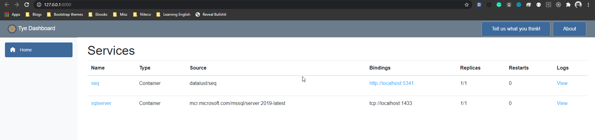
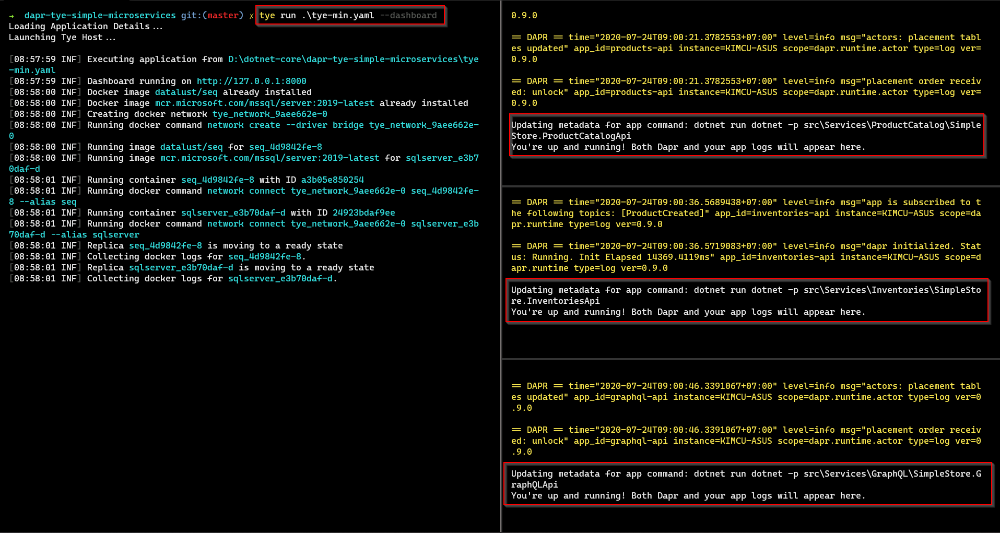
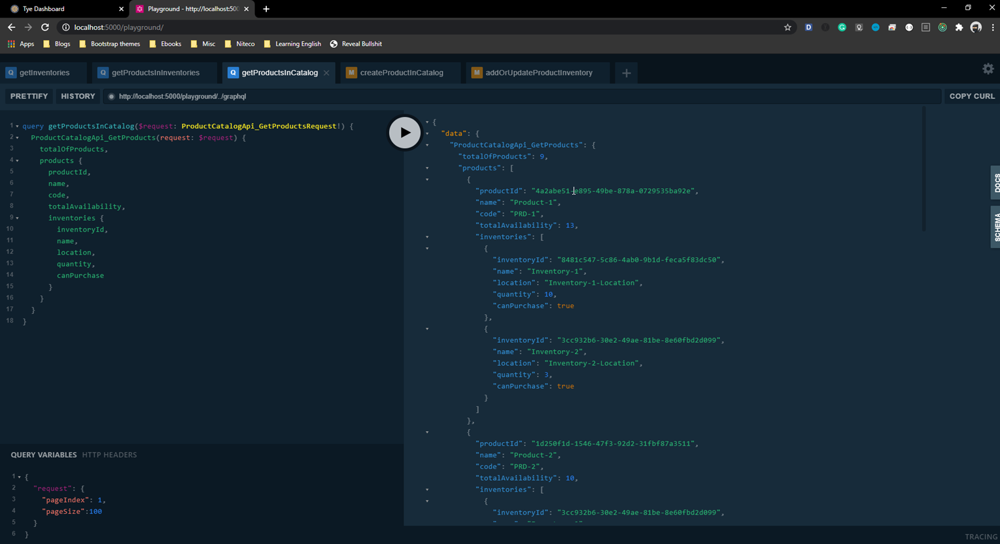
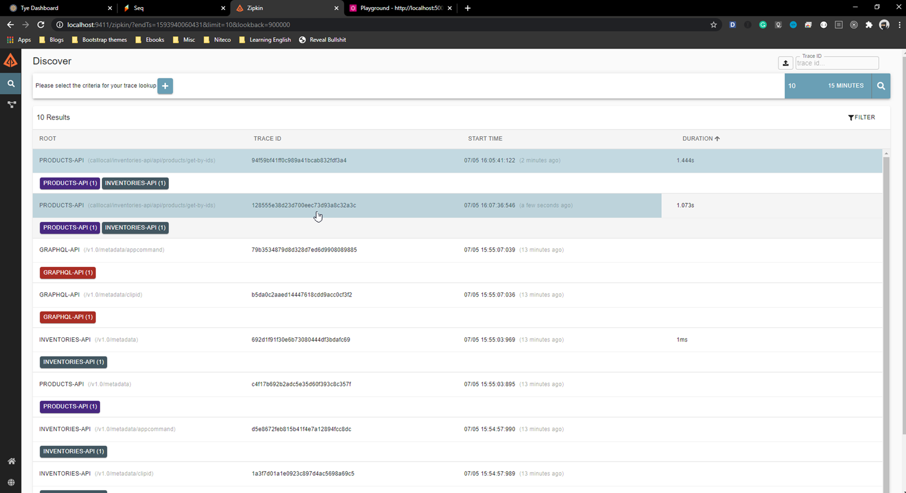

# Starting Services with Dapr

## Getting started

1. Open the `services.json` in the solution folder, then update the following settings

    ```json
    "EnabledTye": false 
    ```
1. Install Dapr by `dapr init`
1. After started infrastructure with the following command, It'll open web browser automatically with the dashboard at `http://127.0.0.1:8000/`

    ```powershell
    tye run .\tye-min.yaml --dashboard
    ```

    

1. Run the following commands in separate Windows Powershell

    1. Start `products-api`

        ```powershell
        dapr run --app-id products-api --app-port 5001 --log-level debug `
        --components-path .\components --config .\components\simplestore-dapr-config.yaml `
        dotnet run dotnet -- -p src\Services\ProductCatalog\SimpleStore.ProductCatalogApi
        ```
    
    1. Start `inventories-api`

        ```powershell
        dapr run --app-id inventories-api --app-port 5002 --log-level debug `
        --components-path .\components --config .\components\simplestore-dapr-config.yaml `
        dotnet run dotnet -- -p src\Services\Inventories\SimpleStore.InventoriesApi
        ```

    1. Start `graphql-api`

        ```powershell
        dapr run --app-id graphql-api --app-port 5000 --log-level debug `
        --components-path .\components --config .\components\simplestore-dapr-config.yaml `
        dotnet run dotnet -- -p src\Services\GraphQL\SimpleStore.GraphQLApi
        ```

    

**Notes:**

- Running this mode, we just use **Tye** as **docker-compose** to start infrastructure, i.e. **seq** and **sqlserver**
- All services, they are, `graphql-api`, `products-api`, `inventories-api` will be started with `dapr run` command with the predefined port as below

    - **graphql-api**: `http://localhost:5000`
    - **products-api**: `http://localhost:5001`
    - **inventories-api**: `http://localhost:5002`
- The port number is defined in `services.json` and it's also passed to `dapr run` commands while starting services

## Experience our services via graphql

- Now, let open the `graphql-api` by clicking on the link `http://localhost:5000` in the screenshot; then enjoy with some examples in [here](examples_graphql_query_mutation.md), for example

    

## For Observability

### Tracing

- Open the browser at - `http://localhost:9411`

    

### Logging

- Open the seq's dashboard at - `http://localhost:9431`

    