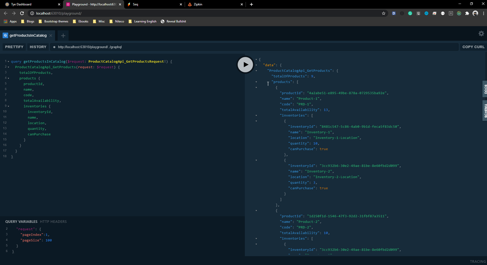
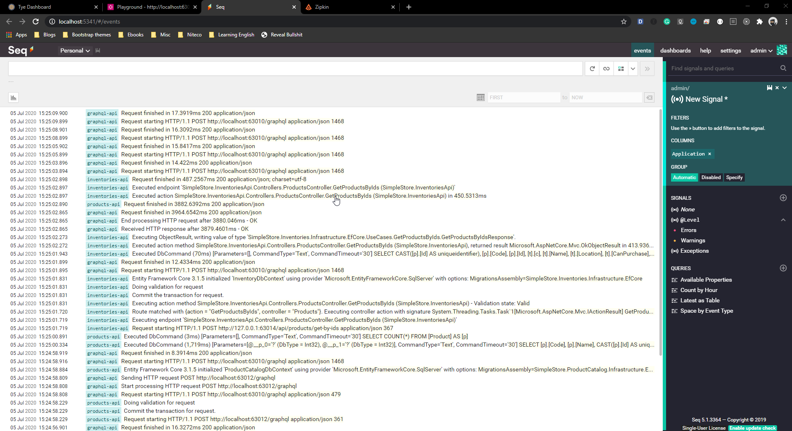

# Start services with Tye

## Getting Started

1. Start with `tye run` command

    ```bash
    tye run --dashboard
    ```

1. It'll open web browser automatically with the dashboard at `http://127.0.0.1:8000/`

    

## Experience our services via graphql

- Now, let open the `graphql-api` by clicking on the link `http://localhost:63010` in the screenshot; then enjoy with some examples in [here](examples_graphql_query_mutation.md), for example

    

- We also can start the browser at `http://simplestore-graphql-api.local:8080` because we're using the **Ingress** feature, of course, from Tye (please note that we have to add this host to **hosts** file)

    ```yaml
    ingress:
    - name: simplestore-ingress
        bindings:
        - port: 8080
            protocol: http
        rules:
        - host: simplestore-graphql-api.local
            service: graphql-api
    ```

## For Observability

### Tracing

- By clicking on the zipkin's address in dashboard - `http://localhost:9411`, we come to the zipkin's dashboard

    

### Logging

- Open the seq's dashboard at - `http://localhost:9431`

    


